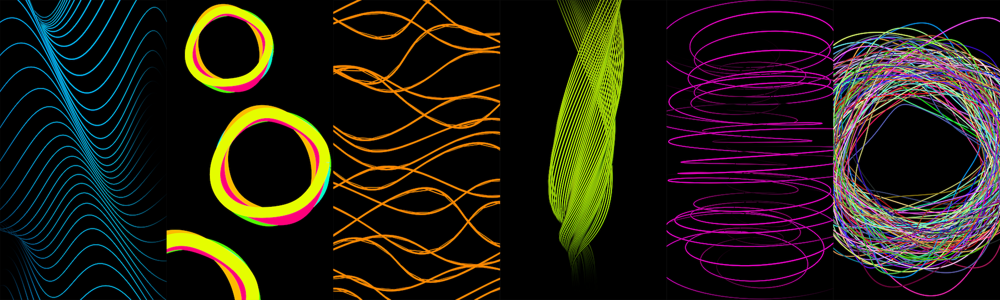

# Unity-CreativeCoding
A collection of creative coding examples in Unity, focusing on dynamic and generative visual effects.

## Sketches

## Included Projects

### 🌀 `LinesOscillation`
Generates flowing, oscillating lines using Catmull-Rom splines. Each line has animated waveforms with Perlin noise and Z-axis motion, creating a lively, vibrating mesh effect.

### 🎨 `OffsetLines`
Draws multiple offset lines with dynamic movement along Bezier curves. Randomized amplitudes and frequencies create a layered, vibrating structure. Uses gradient coloring for added depth.

### 🌌 `SpiralLines`
Builds elegant, spiraling line structures that twist and animate in real-time. Each line has a randomized phase offset, resulting in a dynamic, swirling motion.

### 🌱 `PerlinLines`
Lines that grow and twist over time, driven by Perlin noise. Lines expand and contract organically, creating a constantly shifting, evolving pattern.

### 🌀 `MorphedCircles`
Creates circles that continuously morph their shape using Perlin noise, generating organic, pulsating forms. Each circle uses a different material or shader for visual diversity.

### 🧶 `TangledCircles`
Generates hundreds of tangled circles in 3D space, driven by Perlin noise. Each line has a random color, producing a dense, chaotic, and beautiful mesh of motion.

---

## Contributing
These projects are meant for educational and documentation purposes. Feel free to fork and adapt them!

---

## Licensing
This work is dedicated to the public domain under the **Creative Commons CC0 1.0 Universal (CC0 1.0)** license.

**You are free to:**
- **Share** — copy and redistribute the material in any medium or format  
- **Adapt** — remix, transform, and build upon the material for any purpose, even commercially.

**No conditions.** You do not need to give credit or seek permission.

For details, see: [CC0 1.0 Universal](https://creativecommons.org/publicdomain/zero/1.0/)
